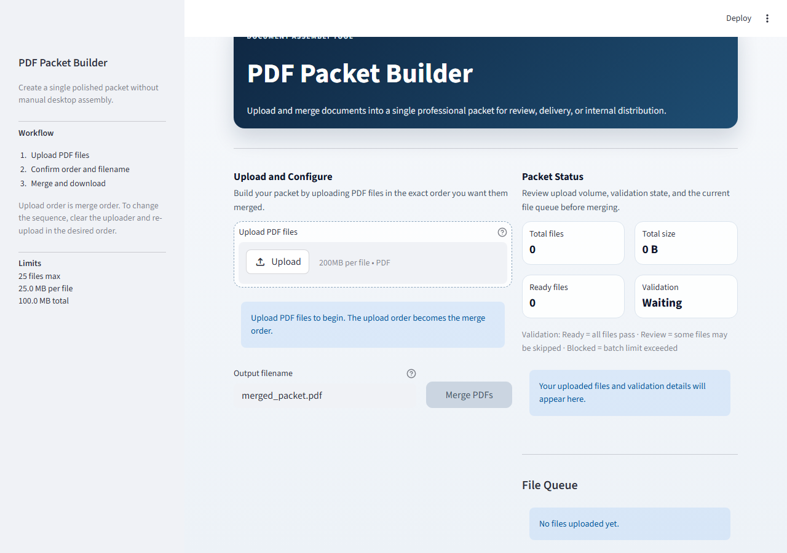

# PDF Packet Builder


A Streamlit application for merging multiple PDF files into a single, professionally ordered
packet — ready for stakeholder review, delivery, or internal distribution.

Upload order becomes merge order. Encrypted, empty, oversized, or malformed files are skipped
with plain-English messages rather than silently failing or crashing the app.

---

## Live Demo

**[Launch PDF Packet Builder](https://pdf-packet-builder.streamlit.app/)**

Deployed on Streamlit Community Cloud — no installation required.

---

## Demo

### Application Screenshot



### Merge Workflow

1. Upload PDF files using the file uploader
2. Review the upload order in the File Queue panel
3. Specify the output filename
4. Click **Merge PDFs**
5. Download the finished packet

---

## Business Value

This project demonstrates:

- Python application development
- Service-layer architecture
- Streamlit UI development
- File processing workflows
- Automated validation
- Error handling
- Unit testing
- CI/CD implementation
- Docker containerization

---

## Features

- **Drag-and-drop upload** — upload up to 25 PDF files at once
- **Ordered merge** — upload order is preserved exactly in the final packet
- **Validation with feedback** — per-file and batch-level checks with plain-English error messages
- **Safe filename sanitization** — the output filename is cleaned before download
- **Custom output filename** — name the packet before downloading
- **Download in one click** — no server-side storage, no accounts, no data retained
- **Docker-ready** — Dockerfile with healthcheck included
- **Tested service layer** — merge logic is fully unit-tested without Streamlit

---

## Tech stack

| Layer | Technology |
|---|---|
| UI | [Streamlit](https://streamlit.io) |
| PDF processing | [pypdf](https://github.com/py-pdf/pypdf) |
| Runtime | Python 3.10+ |
| Container | Docker |
| CI | GitHub Actions |

---

## Project structure

```text
pdf-packet-builder/
├── app.py                       # Streamlit UI — thin orchestration layer only
├── services/
│   ├── __init__.py
│   └── pdf_service.py           # Merge logic, validation, error handling
├── utils/
│   ├── __init__.py
│   └── file_utils.py            # Filename sanitization and size formatting
├── tests/
│   ├── __init__.py
│   ├── test_pdf_service.py      # Service-layer tests (merge, validation, edge cases)
│   └── test_file_utils.py       # Utility tests (filename sanitization, size formatting)
├── assets/
│   └── app-home.png             # Application screenshot
├── .github/
│   └── workflows/
│       └── ci.yml               # GitHub Actions CI — tests on Python 3.10, 3.11, 3.12
├── .dockerignore
├── .gitignore
├── .gitattributes
├── Dockerfile
├── requirements.txt
└── README.md
```

### Why this structure

- `app.py` owns only the UI. It imports and calls the service layer — no merge logic lives here.
- `services/pdf_service.py` owns validation, merge behavior, error classification, and logging.
- `utils/file_utils.py` holds reusable filename and formatting helpers.
- `tests/` covers both the merge path and the utility layer independently of Streamlit, so CI
  runs without a browser or display server.

---

## Local setup

### Prerequisites

- Python 3.10 or newer
- `pip`

### Steps

1. **Clone the repository**

   ```bash
   git clone https://github.com/RichieGarafola/pdf-packet-builder.git
   cd pdf-packet-builder
   ```

2. **Create and activate a virtual environment**

   Windows (PowerShell):

   ```powershell
   python -m venv .venv
   .\.venv\Scripts\Activate.ps1
   ```

   macOS / Linux:

   ```bash
   python -m venv .venv
   source .venv/bin/activate
   ```

3. **Install dependencies**

   ```bash
   pip install --upgrade pip
   pip install -r requirements.txt
   ```

4. **Start the app**

   ```bash
   streamlit run app.py
   ```

   The app opens at `http://localhost:8501`.

---

## How to use

1. Open the app in your browser.
2. Upload one or more PDF files. Upload order is merge order.
3. Review the File Queue in the status panel to confirm sequence.
4. Set the output filename — `.pdf` is enforced automatically, special characters become underscores.
5. Click **Merge PDFs**.
6. Click **Download merged PDF** to save the finished packet.

If any file is unreadable, encrypted, empty, or oversized, it is skipped and the reason is shown
in the UI. If every file fails validation, the app returns a clear error instead of producing
an empty or corrupt output.

---

## Operational limits

| Limit | Default |
|---|---|
| Maximum files per merge | 25 |
| Maximum size per file | 25 MB |
| Maximum total upload size | 100 MB |

Limits are configured in a single `UploadLimits` dataclass and enforced consistently across
the UI and service layers.

---

## Running tests

```bash
python -m unittest discover -s tests -v
```

The test suite covers:

**`tests/test_pdf_service.py`**
- Merging multiple PDFs and verifying page count and order
- Skipping invalid or malformed files while preserving valid ones
- Rejecting batches that exceed the configured file-count limit
- Raising a clear error when every uploaded file is invalid
- Rejecting empty source lists before any processing begins
- Per-file validation: empty files, oversized files, wrong extensions, custom limits

**`tests/test_file_utils.py`**
- Filename sanitization: empty input, `None`, whitespace, all-invalid characters
- Extension handling: plain stems, existing `.pdf`, non-`.pdf` extensions, dot-prefixed names
- Character sanitization: spaces, hyphens, uppercase, dots in stem, long filenames
- File size formatting: byte, KB, MB, and GB ranges; boundary values; negative input

---

## Deployment

### Streamlit Community Cloud

1. Fork or clone this repository to your GitHub account.
2. Go to [share.streamlit.io](https://share.streamlit.io) and sign in with GitHub.
3. Click **New app**, select this repository, set branch to `main`, set main file to `app.py`.
4. Click **Deploy** — no additional configuration required.

### Docker

```bash
docker build -t pdf-packet-builder .
docker run --rm -p 8501:8501 pdf-packet-builder
```

The container exposes Streamlit on port `8501` and includes a healthcheck.

---

## Architecture note

Merge logic is fully isolated in `services/pdf_service.py`. The same service can be imported
by a scheduler, REST API endpoint, or automation worker without any changes — it has no
dependency on Streamlit. The Streamlit UI is one possible front end, not an architectural
requirement.

---

## Future enhancements

- [ ] Page preview thumbnails before merge
- [ ] Drag-and-drop reordering of uploaded files
- [ ] Per-file page range selection (merge only selected pages)
- [ ] Watermark or header/footer injection on merge
- [ ] REST API endpoint wrapping the existing service layer (FastAPI)
- [ ] Support for password-protected PDFs with user-supplied password

---

## License

[MIT](LICENSE)
